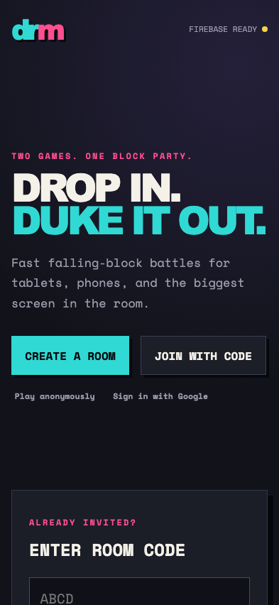
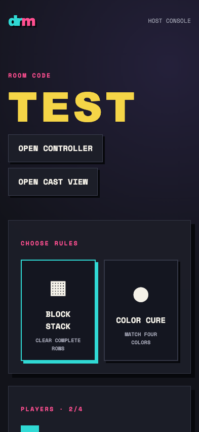
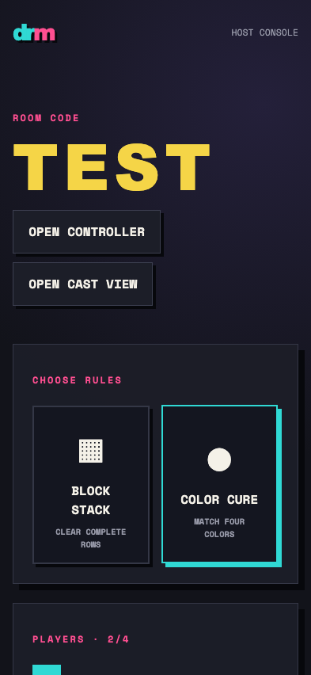

# Test: US-001: host creates an emulator-backed room

## Landing page is ready

**Verifications:**
- [x] Firebase emulator environment is connected
- [x] Anonymous and Google choices are visible

---
## Created room opens in the host console

**Verifications:**
- [x] Generated room code is shown
- [x] Both game modes and the roster are shown

---

## Host chooses Color Cure

**Verifications:**
- [x] Color Cure is selected

---
