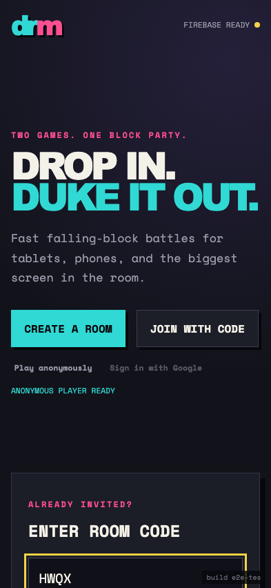
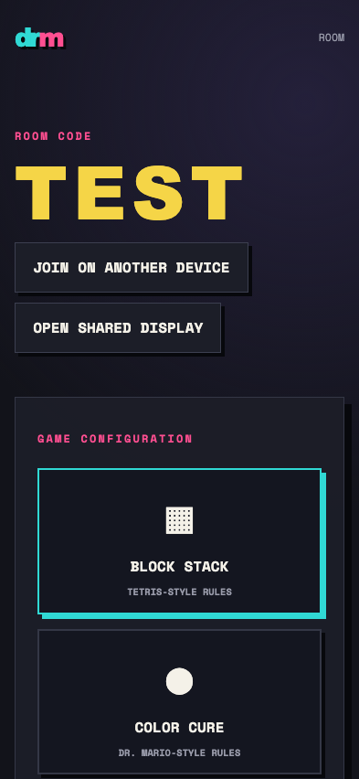
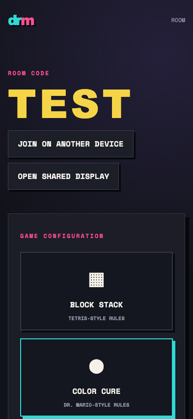

# Test: US-001: host creates and configures a real room

## Anonymous Firebase player is ready

**Verifications:**
- [x] Firebase is configured
- [x] Deterministic E2E build identifier is visible
- [x] UI does not render a fabricated game board

---

## Firestore room contains only its real host

**Verifications:**
- [x] Room code contains exactly four letters
- [x] Exactly one named host membership exists
- [x] Play and TV starts require the implemented Color Cure rules

---

## Ruleset configuration persists in Firestore

**Verifications:**
- [x] Color Cure remains selected
- [x] No match is represented

---
