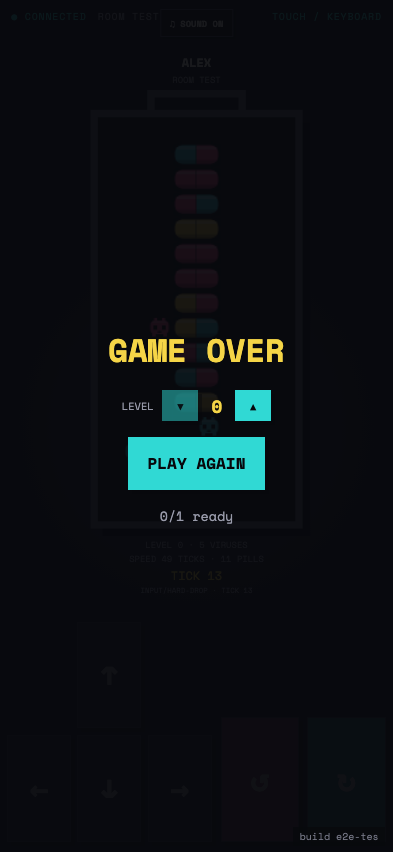

# Test: US-001: host creates and configures a real room

## Anonymous Firebase player is ready

**Verifications:**
- [x] Firebase is configured
- [x] Audio mix settings are available before entering a room
- [x] Deterministic E2E build identifier is visible
- [x] UI does not render a fabricated game board

---

## Firestore room contains only its real host

**Verifications:**
- [x] Room code contains exactly four letters
- [x] Audio mix settings remain available while configuring the room
- [x] Exactly one named host membership exists
- [x] Block Stack can start locally while TV mode still requires a controller

---

## Ruleset configuration persists in Firestore

**Verifications:**
- [x] Color Cure remains selected
- [x] No match is represented

---

## A terminal bottle declares the match result

**Verifications:**
- [x] Single-player top-out ends the match
- [x] The player can request a rematch

---
