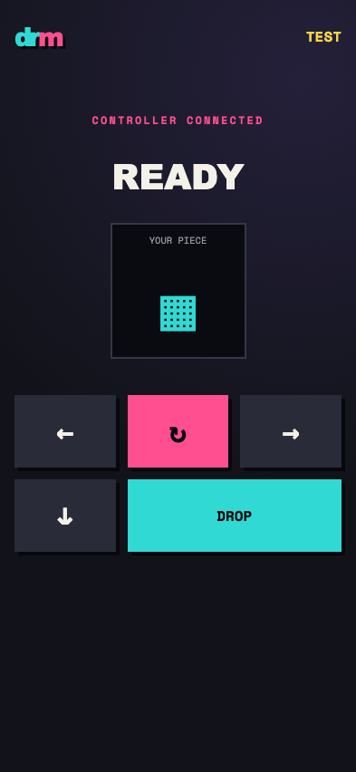
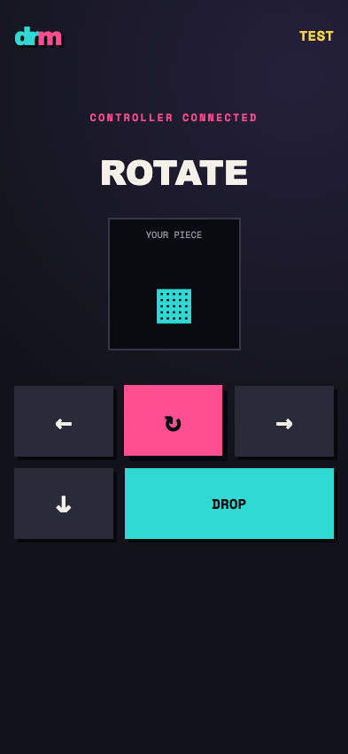
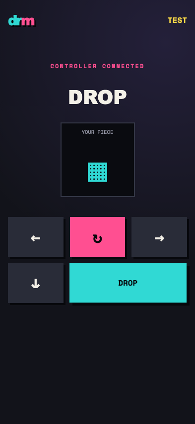

# Test: US-002: player uses the phone controller

## Phone controller fits the mobile viewport

**Verifications:**
- [x] Room and five controls are visible

---
## Rotate input receives immediate feedback

**Verifications:**
- [x] Rotate acknowledgement is visible

---

## Hard drop receives immediate feedback

**Verifications:**
- [x] Drop acknowledgement is visible

---
