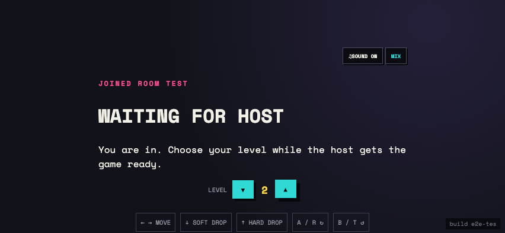
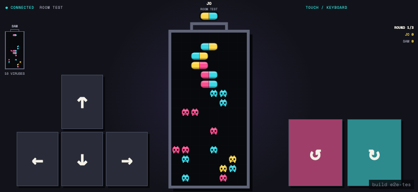
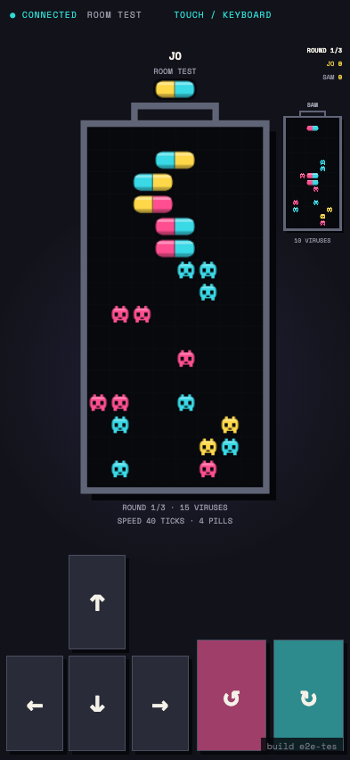
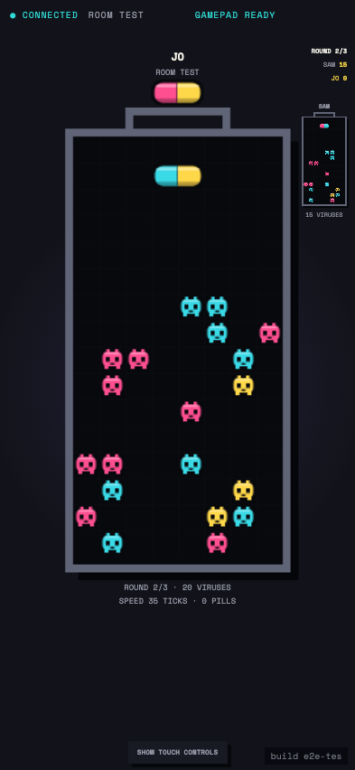
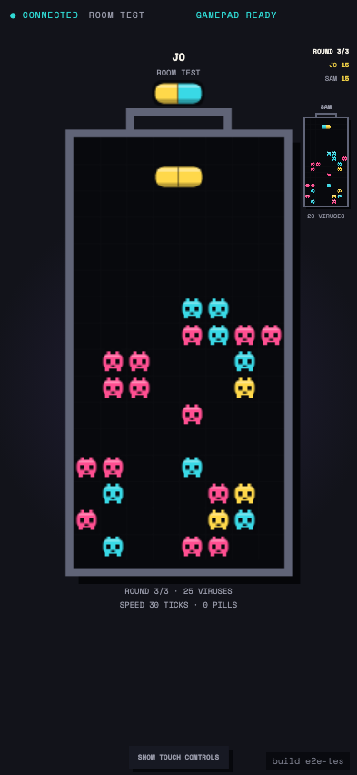
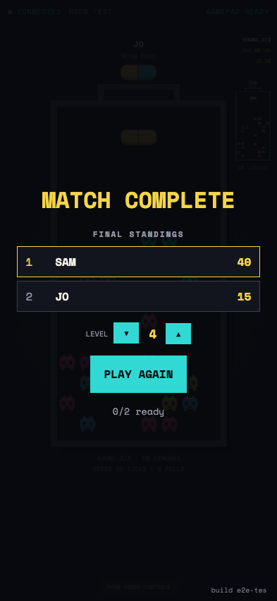

# Test: US-002: a second authenticated device joins the room

## Second device joins and waits for a real start record

**Verifications:**
- [x] Direct invitation URL joined the requested room
- [x] The player can choose a starting level with pointer controls
- [x] UI waits for the host start record
- [x] Audio mix settings are available while waiting
- [x] Waiting screen teaches keyboard and gamepad controls

---

## Landscape controller records tick-tagged input

**Verifications:**
- [x] D-pad exposes left, right, accelerate, and hard drop
- [x] Both rotation directions are available
- [x] Keyboard bindings expose arrows, R, and T
- [x] Recorded command includes its player tick

---

## Portrait phones retain the full controller and opponent context

**Verifications:**
- [x] The local bottle remains visible in portrait
- [x] Movement and rotation controls remain available
- [x] A compact replay-derived opponent bottle is visible
- [x] The portrait controller fits the viewport

---

## Both ready controllers enter the next round regardless of click order

**Verifications:**
- [x] Each controller enters at its independently selected next level
- [x] D-pad changes level and any non-directional gamepad button activates the default action
- [x] The survivor scores the viruses left by the player who topped out
- [x] Neither controller reports a permission failure

---

## Reversing ready order starts the final round without a permission race

**Verifications:**
- [x] Both controllers reach round three at independent levels
- [x] Survivor points accumulate across rounds
- [x] The reversed ready order produces no permission failure

---

## Match complete centers the final standings for every player

**Verifications:**
- [x] Final standings appear directly under Match Complete
- [x] Players are ordered by accumulated points
- [x] The rematch action remains available below the standings

---
