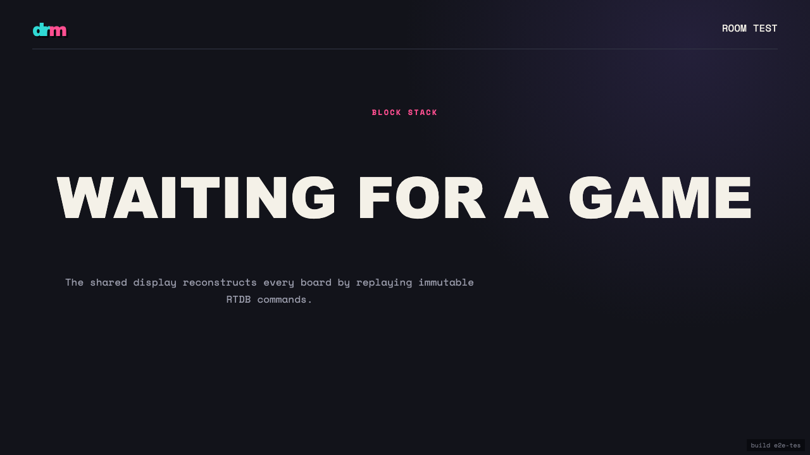

# Test: US-003: shared display reads real room configuration

## Shared display waits for canonical game state

**Verifications:**
- [x] Display loaded the real room code
- [x] Display loaded the persisted ruleset
- [x] No invented game board is displayed
- [x] Display states its command-replay dependency

---
