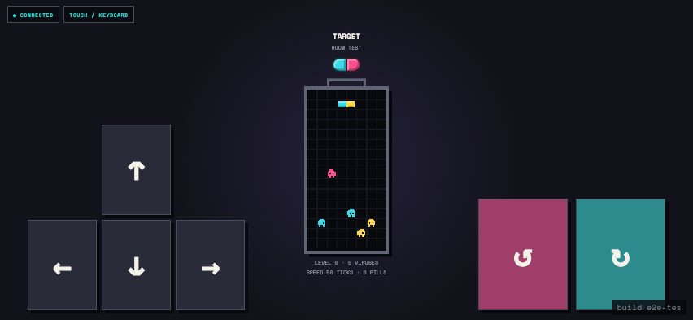
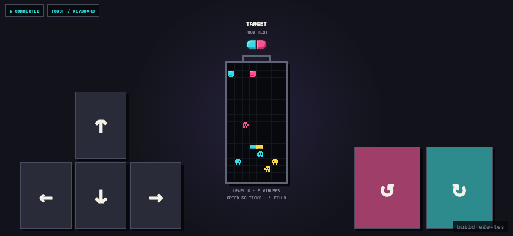
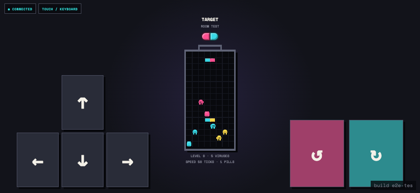

# Test: US-004: incoming rain waits, falls slowly, resolves, then yields to the next pill

## Incoming rain waits for the active pill

**Verifications:**
- [x] The current pill remains active after the attack arrives
- [x] Rain is queued and not yet visible in the bottle

---

## Rain falls slowly between pills

**Verifications:**
- [x] No player-controlled pill is active while rain falls
- [x] Two independent rain pieces are visible in the bottle
- [x] Observed row movement took at least 180ms

---

## The next pill spawns after rain finishes

**Verifications:**
- [x] No rain remains in flight
- [x] Both rain pieces landed in the bottle
- [x] The next player-controlled pill is now active

---
