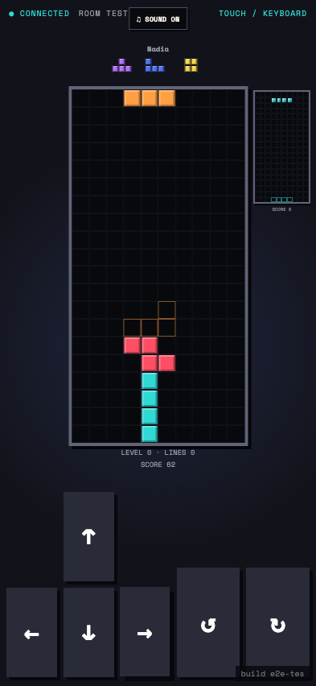
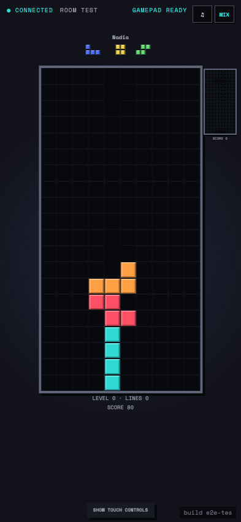

# Test: US-005: Block Stack starts a deterministic playable controller

## Block Stack runs from a seeded immutable command journal with a compact in-viewport opponent board

**Verifications:**
- [x] The 10 by 20 play matrix is visible and gravity moves its active piece
- [x] The compact opponent board is fully contained by the controller viewport
- [x] Next queue and ghost placement are rendered locally
- [x] Holding hard drop affects only one piece and a fresh press drops the next
- [x] Movement and both SRS rotations are available
- [x] Score and line count start from deterministic state

---

## Using a gamepad hides phone controls and gives the board more space

**Verifications:**
- [x] A real gamepad action switches the controller to gamepad mode
- [x] Touch movement and rotation controls are hidden
- [x] The local board keeps its size while the compact opponent remains visible
- [x] The player can explicitly restore touch controls

---
