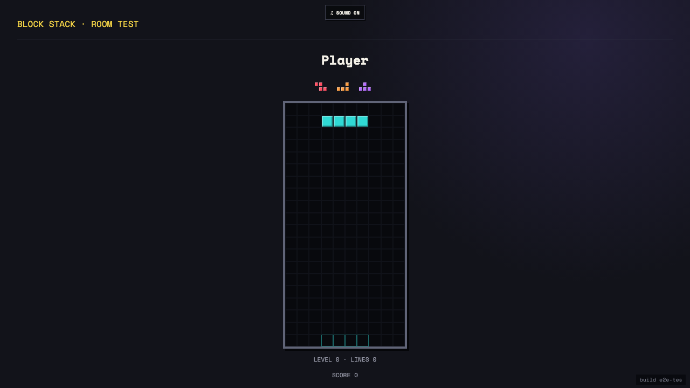

# Test: US-006: shared Block Stack display replays controller gravity

## The shared display advances its replay-derived falling piece

**Verifications:**
- [x] The cast visibly moves its active piece as replay advances
- [x] The cast reconstructs the ghost without receiving board state
- [x] Upcoming pieces are rendered as miniature tetrominoes
- [x] The controller remains connected while cast gravity advances

---
