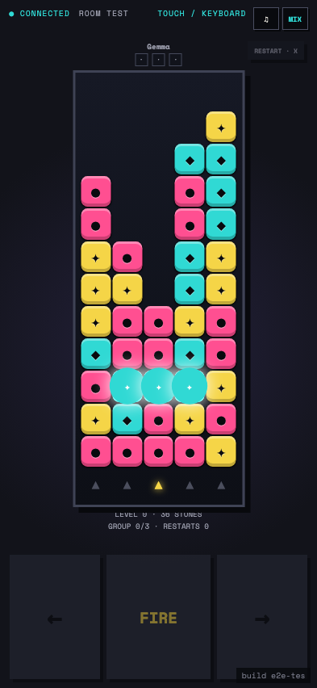
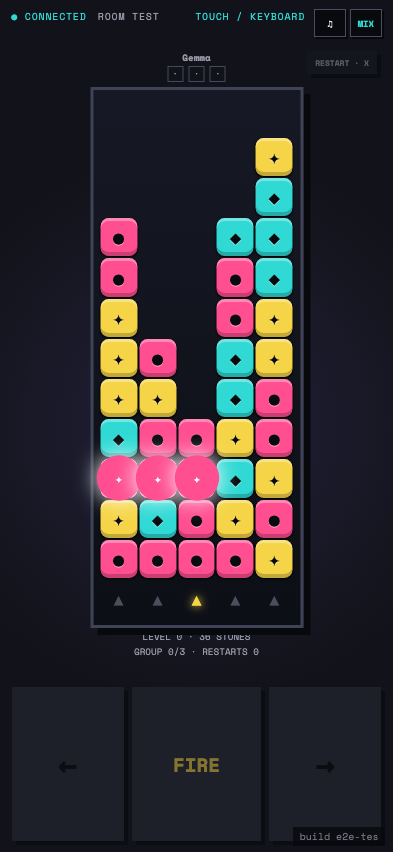

# Test: US-007: Quarry Match plays a solver-backed puzzle race

## Quarry Match starts a seeded solver-backed puzzle in a phone-safe controller

**Verifications:**
- [x] The board contains five full columns and sixty stones
- [x] Fire and horizontal controls are available
- [x] The controller fits the phone viewport

---

## The current shot group uses full Quarry stone renders

**Verifications:**
- [x] One held stone has the same occupied stone treatment as the board
- [x] Restart remains visible beside the controller

---

## Every match intersecting the moved column explodes in one simultaneous stage

**Verifications:**
- [x] The first stage is visibly bursting before its stones settle
- [x] The authoritative result is final while the board still shows the first stage

---

## Settled adjacent columns trigger a distinct follow-up combo stage

**Verifications:**
- [x] The second stage waits for the first stage to finish
- [x] The follow-up stage repeats the burst effect
- [x] The follow-up stage triggers its own combo sound cue

---

## Direct shots and horizontal cascades empty the replayed board and claim the round

**Verifications:**
- [x] Every stone was removed in same-colour groups of three
- [x] The first clear is the immutable round winner
- [x] The shared next-round flow is ready

---
