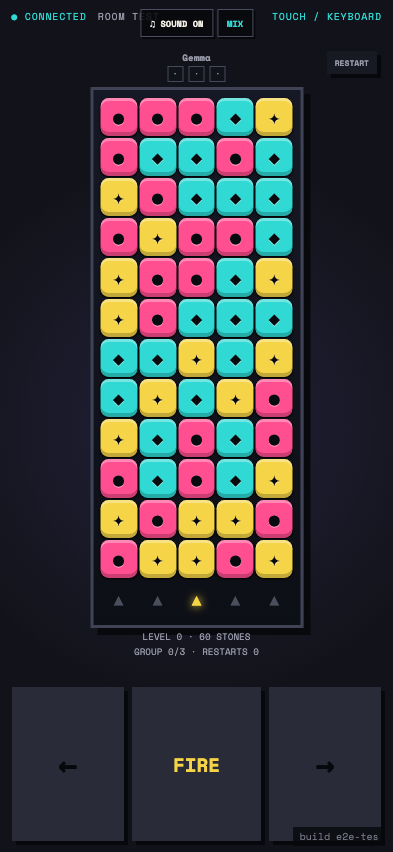
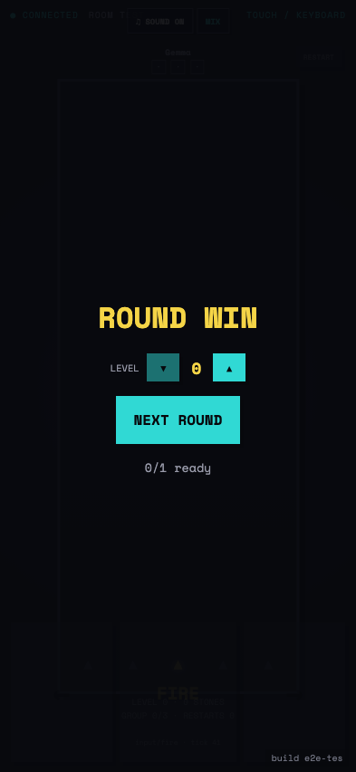

# Test: US-007: Quarry Match plays a solver-backed puzzle race

## Quarry Match starts a seeded solver-backed puzzle in a phone-safe controller

**Verifications:**
- [x] The board contains five full columns and sixty stones
- [x] Fire and horizontal controls are available
- [x] The controller fits the phone viewport

---

## Matching triples empties the replayed board and claims the round

**Verifications:**
- [x] Every stone was removed in same-colour groups of three
- [x] The first clear is the immutable round winner
- [x] The shared next-round flow is ready

---
