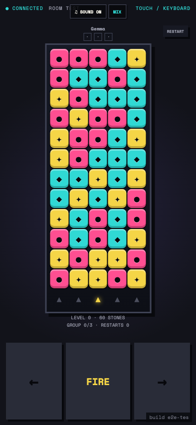
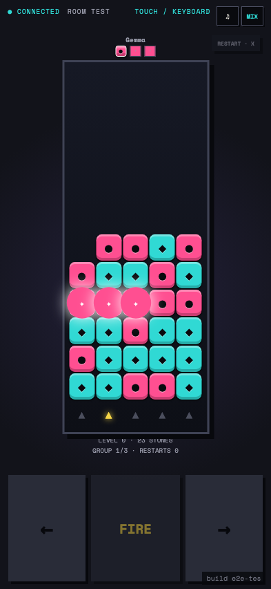
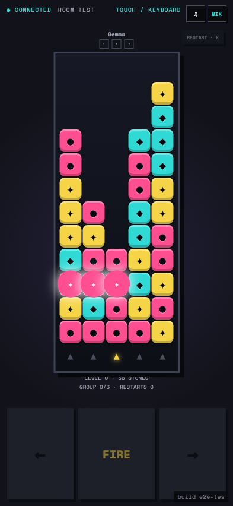
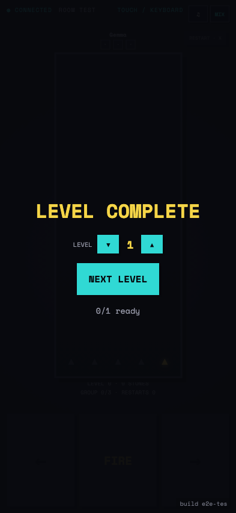

# Test: US-007: Quarry Match plays a solver-backed puzzle level

## Level-zero Quarry Match starts with a half-height solver-backed puzzle

**Verifications:**
- [x] The fixed twelve-row board contains thirty bottom-aligned stones
- [x] Fire and horizontal controls are available
- [x] The controller fits the phone viewport

---

## The current shot group uses full Quarry stone renders

**Verifications:**
- [x] One held stone has the same occupied stone treatment as the board
- [x] Restart remains visible but waits for the cave-in to finish

---

## Every match intersecting the moved column explodes in one simultaneous stage

**Verifications:**
- [x] The first stage is visibly bursting before its stones settle
- [x] The authoritative result is final while the board still shows the first stage
- [x] The player can aim during the cascade while another shot remains blocked

---

## Settled adjacent columns trigger a distinct follow-up combo stage

**Verifications:**
- [x] The second stage waits for the first stage to finish
- [x] The follow-up stage repeats the burst effect
- [x] The follow-up stage triggers its own combo sound cue

---

## Direct shots and horizontal cascades empty the replayed solo level

**Verifications:**
- [x] Every stone was removed in same-colour groups of three
- [x] The clear completes the solo level without declaring a race winner
- [x] The next-level flow defaults one level higher

---
