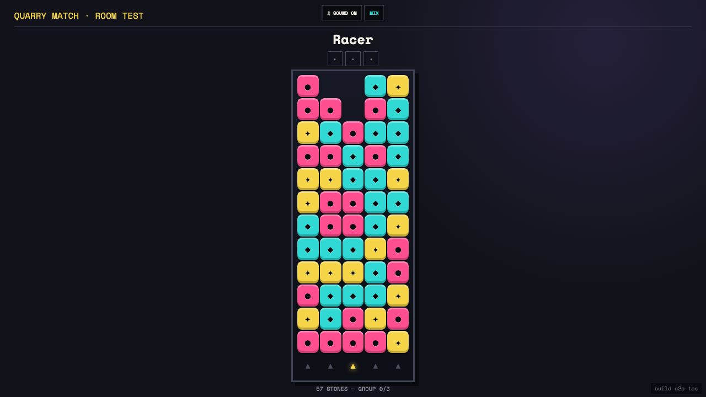

# Test: US-008: shared Quarry Match display replays controller shots

## The TV reconstructs Quarry Match shots and owns shared-display audio

**Verifications:**
- [x] The cast replayed the controller triple without receiving board state
- [x] The controller and cast show the same remaining stone count
- [x] Audio controls are on the TV and not the controller
- [x] The shared display identifies the racer and round wins

---
