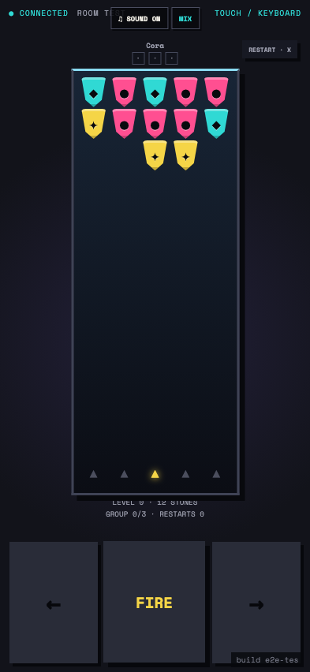
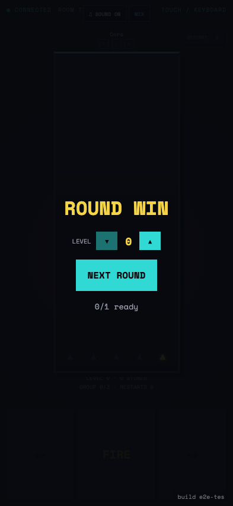

# Test: US-009: Crystal Canopy keeps a solver-backed puzzle fixed to the ceiling

## A low-level Crystal Canopy hangs twelve crystals from the cavern ceiling

**Verifications:**
- [x] Level zero contains twelve solver-backed crystals
- [x] The ceiling-hung crystal treatment and launcher are visible
- [x] The controller fits the phone viewport

---

## Tip shots clear the canopy without gravity or cascades

**Verifications:**
- [x] Exactly twelve direct shots empty the level-zero puzzle
- [x] No Quarry cascade was generated
- [x] The shared round lifecycle declares the clear

---
