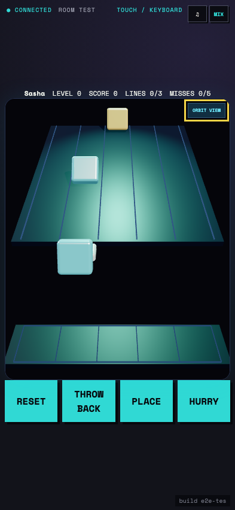
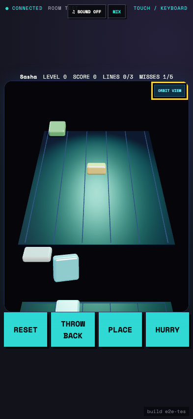

# Test: US-010: Stax tumbles tiles down a deterministic 3D ramp

## A glossy five-lane 3D ramp descends toward the player, loaded paddle, and lower bins

**Verifications:**
- [x] The deterministic wave begins with a three-second countdown
- [x] Tiles roll edge over edge from the elevated far end toward the player
- [x] The paddle is between the track and five vertical tile stacks
- [x] Orbit inspection can temporarily replace the five touch lanes
- [x] The complete controller fits a phone viewport

---

## A seeded tile rotates into place while depressing the aligned paddle

**Verifications:**
- [x] The paddle moved left using the shared directional input
- [x] The arriving tile entered the LIFO paddle stack
- [x] The catch is rendered as a settling transition rather than a resize
- [x] No tile was missed while the paddle was aligned

---

## The tile flips forward, then drops vertically into the lower bin

**Verifications:**
- [x] Place consumes exactly the newest paddle tile into the selected bin column
- [x] Placement has a visible flip-and-drop transition
- [x] The bin keeps each column in one physical vertical stack
- [x] Reset, throw-back, place, and hurry controls remain available

---

## A missed tile tumbles beyond the ramp and falls out of sight

**Verifications:**
- [x] The paddle is deliberately outside the incoming lane
- [x] The miss remains visible as a falling transition after leaving the ramp
- [x] The documented fall is captured at a deterministic replay offset
- [x] The previously placed tile remains rendered in its bin stack

---
