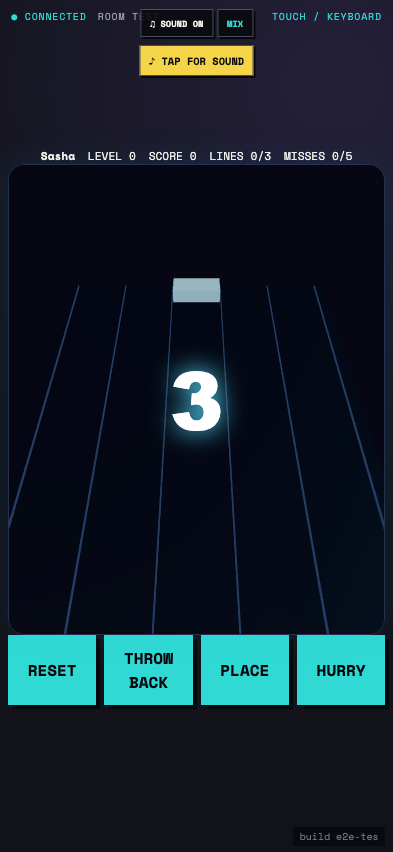
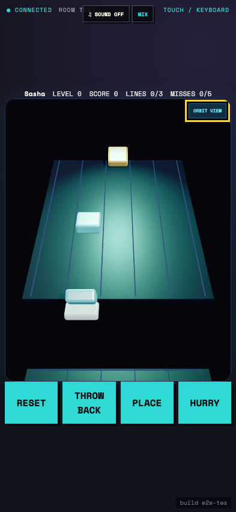
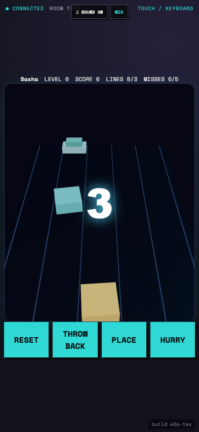

# Test: US-010: Stax tumbles tiles down a deterministic 3D ramp

## A lit five-lane 3D ramp presents the paddle, bin, countdown, and touch lanes

**Verifications:**
- [x] The deterministic wave begins with a three-second countdown
- [x] All five ramp lanes are directly touchable
- [x] The complete controller fits a phone viewport

---

## A seeded tile visibly tumbles down its lane and is caught by the aligned paddle

**Verifications:**
- [x] The paddle moved left using the shared directional input
- [x] The arriving tile entered the LIFO paddle stack
- [x] No tile was missed while the paddle was aligned

---

## A legal placement updates the bin before deterministic reset restores the wave

**Verifications:**
- [x] Place consumes exactly the newest paddle tile
- [x] Reset reconstructs the seeded three-second wave
- [x] Reset, throw-back, place, and hurry controls remain available

---
