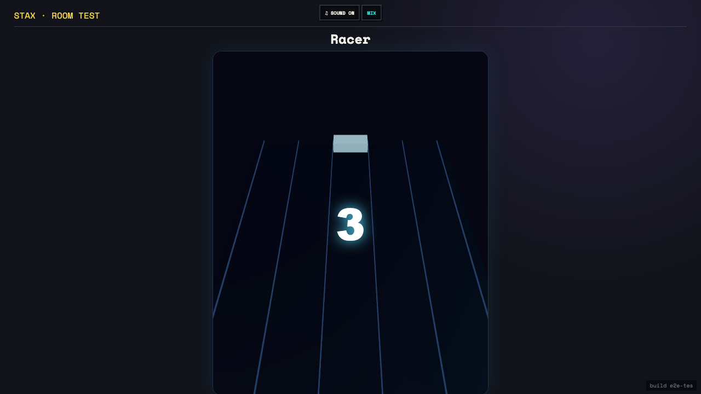

# Test: US-011: Stax shared display reconstructs the controller ramp

## The TV reconstructs the Stax wave and owns shared-display piano audio

**Verifications:**
- [x] The cast replayed the controller restart without receiving ramp or bin state
- [x] Controller and cast independently show the same fresh three-second wave
- [x] Audio controls are on the TV and not the phone controller
- [x] The shared display names the controller player and shows match points

---
