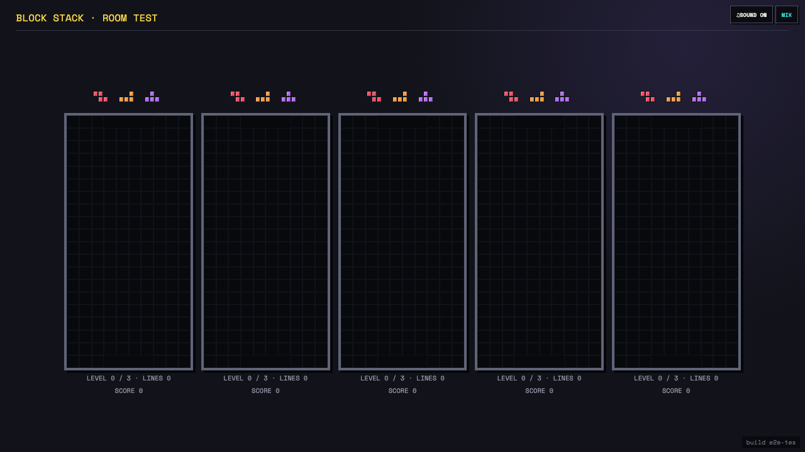

# Test: US-012: an unbounded roster survives a cast round transition

## Five players remain live on the shared display after every controller readies

**Verifications:**
- [x] The room started with more than four participating players
- [x] The host plays in one tab while its separately opened cast stays active
- [x] The cast replaced its first-round subscriptions and keeps every board in the TV viewport
- [x] Concurrent readiness created one successor without surfacing permission errors

---
